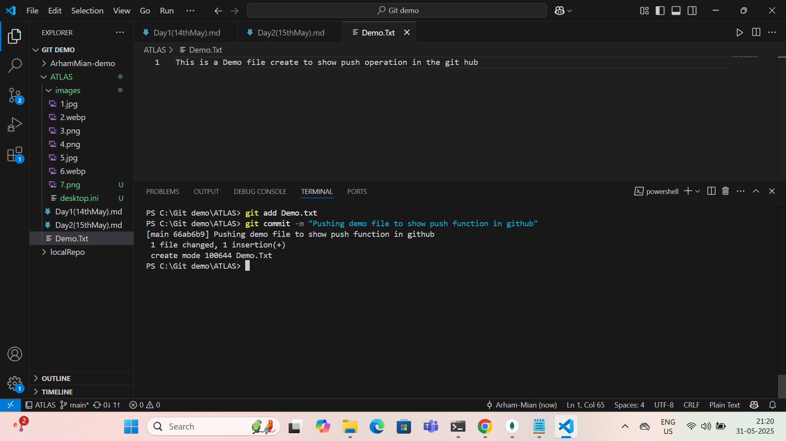

Day 2 : 15/04/2024 : Arham Mian : aarhammi@amazon.com

=============================================================================

----------------------Dev ops and cloud fundamentals-------------------------

=============================================================================

Task 1: What is Git and GitHub?

Git is a version control system used by developers to track changes in source code during software development. It allows multiple people to work on a project at the same time, manage code revisions, and revert to earlier versions if needed. Git operates locally on your machine, keeping a full history of changes.

GitHub is a cloud-based platform that hosts Git repositories online. It provides tools for collaboration, issue tracking, and project management, allowing developers to share code, contribute to open-source projects, and work together from anywhere. While Git is the tool, GitHub is the service built around that tool to make collaboration easier.

In short:  manages your code versions, and GitHub helps you share and collaborate on that code online.

=============================================================================

Task 2 : What do you mean by Repo (Repository) ?

A Git repository is where your project’s files and history are stored.

* Public Repo: Visible to everyone. Anyone can see or clone it.
* Private Repo: Only visible to you and collaborators you grant access to.

Create a new repo using :

git init           // Initialize a local Git repo

Or clone an existing one using :

git clone https://github.com/username/repo.git

=============================================================================

Task 3 : What do you mean by Push ?

Push sends your committed changes to a remote repository (like GitHub).

You can do push using the following command : 

git push origin main

=============================================================================

Task 4 : What do you mean by Pull ?

Pull fetches changes from the remote repository and merges them with your local copy.

You can use pull in following way: 
git pull origin main

=============================================================================

Task 5 : What do you mean by Commit  ?

A commit saves your staged changes in the repo history with a message.

You can do the commit in following way : 

git commit -m "Added login feature"

=============================================================================

Task 6 : What do you mean by .gitignore

A file where you list files/folders Git should ignore.

Example `.gitignore` content:

node_modules/
.env
*.log

This tells Git not to track the `node_modules` folder, `.env` file, or any `.log` files.

=============================================================================

Task 7 : What do you mean by .md (Markdown) ?

Markdown files (`.md`) like `README.md` are used for writing formatted documentation (e.g., bold, headers, code blocks) for your project.

Example:

markdown
# Project Title
This is a **Git** tutorial.

=============================================================================

Task 8 : What do you mean by git status ?

Shows the current state of your working directory and staging area.

git status Sample output:

On branch main
Changes not staged for commit:
  modified:   index.html

=============================================================================

Task 9 : What do you mean by git add . ?

It Stages all changes (new, modified, deleted) to be committed.

git add .

Alternatively, to add a specific file:

git add filename.txt

=============================================================================

Task 10  : Installtion and configuration of Git and Github 

Done the installation and configuration of git.

=============================================================================

Task 11 : Show functionality of add function 

Screenshot:

=============================================================================

Task 12 : Show functionaliity of commit function 

Screenshot:

=============================================================================

Task 13 : Show functionality of push function 

Screenshot: 

