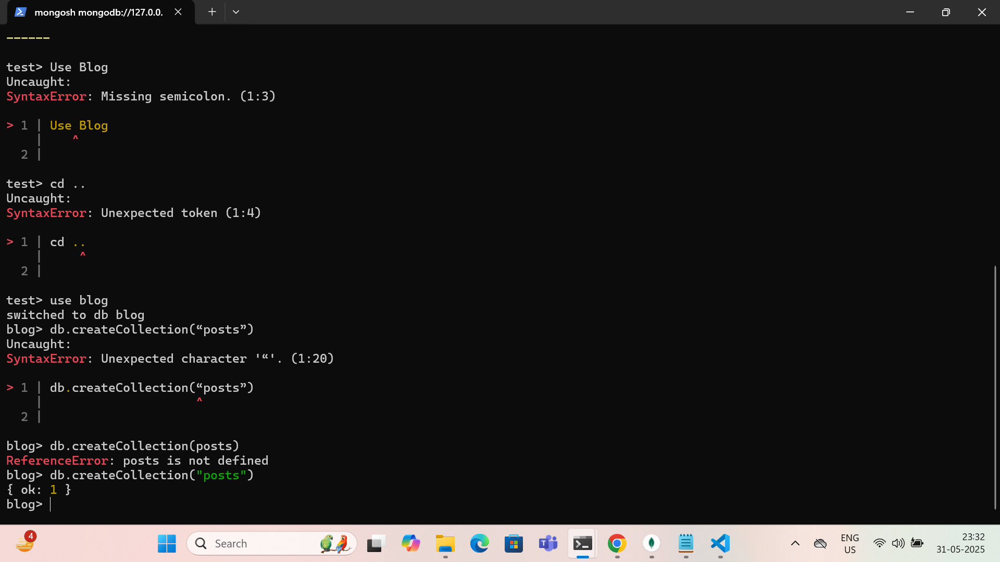

Day 3 : 21/04/2024 : Arham Mian : aarhammi@amazon.com

=============================================================================

----------------------Dev ops and cloud fundamentals-------------------------

=============================================================================

Task 1 : Create a file names 21st May.txt and push it to your git hub.

Done , Screenshot : 

=============================================================================

Task 2 : Define ACID properties 

ACID – Definitions

ACID stands for **Atomicity, Consistency, Isolation, and Durability**. These are the key properties that ensure reliable processing of database transactions.

 1. **Atomicity**

> **Definition**: A transaction is **all or nothing**. Either every operation within the transaction is completed successfully, or none of them are applied.

**Example**:
If you're transferring money from Account A to Account B:

* Debit from A 
* Credit to B 
  If the credit fails, the debit is **rolled back**, so no money is lost.

2. **Consistency**

> **Definition**: A transaction must move the database from one **valid state** to another, maintaining all predefined rules and constraints.

**Example**:
If a table has a constraint that a balance cannot be negative, the system must prevent transactions that would violate that rule.

3. **Isolation**

> **Definition**: Concurrent transactions are **isolated** from each other. The intermediate state of a transaction is **invisible** to others until it's committed.

**Example**:
Two people trying to book the last seat on a flight shouldn’t both be able to see it as available and book it simultaneously. One should succeed, the other should be blocked or fail.

4. **Durability**

> **Definition**: Once a transaction is **committed**, the changes are **permanent**, even if there is a system crash.

Example:
After a successful bank transfer, the money remains moved—even if the system crashes right after the confirmation.

=============================================================================

Task 3 : Install MongoDB server , MongoDB Shell and MongoDB compas 

Done 

=============================================================================

Task 4 : Check MongoDB version using MongoD --version

Done , Screenshot : 

=============================================================================

Task 5 : Start and connect to Mongo Shell using Mongosh

Done , Screenshot : 

=============================================================================

Task 6 : Create a DataBase Named Blog 

Done , Screenshot : 

=============================================================================

Task 7 : Create collection Posts

Done , Screenshot : 

=============================================================================

Task 8 : Use insertOne to update your 1st post

Done , Screenshot : 

=============================================================================

Task 9 : Use find to check the details of collection

Done , Screenshot : 

=============================================================================

Task 10 : Try using CRUD opertions and various quires in MongoDB

Done , Not able to take Screenshot because quries was so long so created a new file named : "MongDB_Practice.txt" with all my MongoDB work 
Please find the file here 