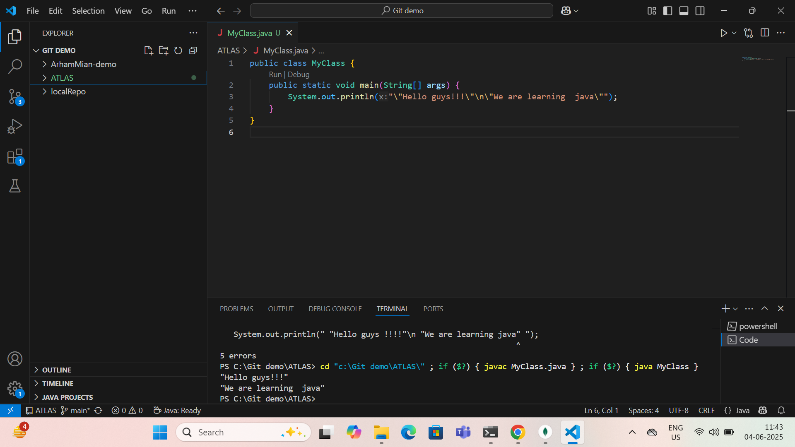
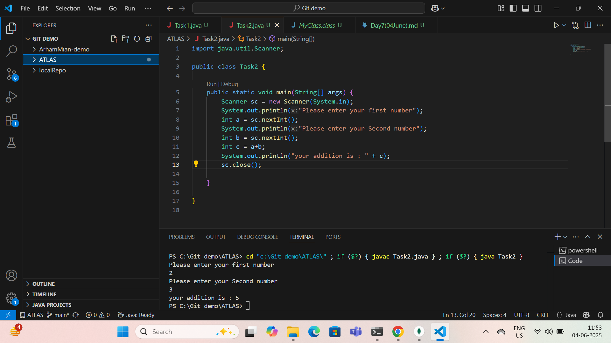
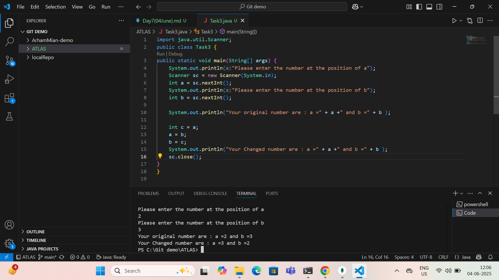

Day 7 : 04/06/2024 : Arham Mian : aarhammi@amazon.com

=============================================================================

----------------------Java fundamentals-------------------------

=============================================================================

Task 1 : 

Create a code to display 
“Hello guys!!!! “
“We are learning Java”

Using a single output statement…

Done , Screenshot : 

=============================================================================

Task 2:

Write a Program in Java to Add two Numbers.
Input: 2 3
Output: 5

Done, Screenshot :

=============================================================================

Task 3:

Write a Program to Swap Two Numbers
Input: a=2  b=5
Output: a=5  b=2

Done, Screenshot :

=============================================================================

Task 4:
 Create a code in which you have 4 methods add, subtract, multiply and divide (return type int) with a main method..to all all the other methods 

Out put:

Main started
Sum of 2 numbers is …..
Diff of 2 numbers is —-
Product of 2 numbers ….
Division of 2 numbers is ….
Main ended

Done, But unable to attach Screenshot because code was lengthy , please check the file [here](https://github.com/Arham-Mian/ATLAS_Practice/blob/main/Task4.java)

=============================================================================

Task 5 : Write a program to check if a is greater or b.. Use ternary op

Done, But unable to attach Screenshot because code was lengthy , please check the file [here](https://github.com/Arham-Mian/ATLAS_Practice/blob/main/Task5.java)

=============================================================================

Task 6 : Write a program to take input from the user and display it to the user

Input:

Id : Prasunamba
Pwd: 123456789

Output:

Hi ,

	Your login id is Prasuanmba
And your pwd is *********

HInt : 
For scanner … import java.util.scanner;

Scanner sc = new Scanner(System.in);
Id = sc.nexLine();

Done, But unable to attach Screenshot because code was lengthy , please check the file [here](https://github.com/Arham-Mian/ATLAS_Practice/blob/main/Task6.java)

=============================================================================

Task 7 : 
Write a program to create a class named Customer 
Call the customer class in Task007 class using an object

Done, But unable to attach Screenshot because code was lengthy , please check the file [here](https://github.com/Arham-Mian/ATLAS_Practice/blob/main/Task7.java)

=============================================================================

