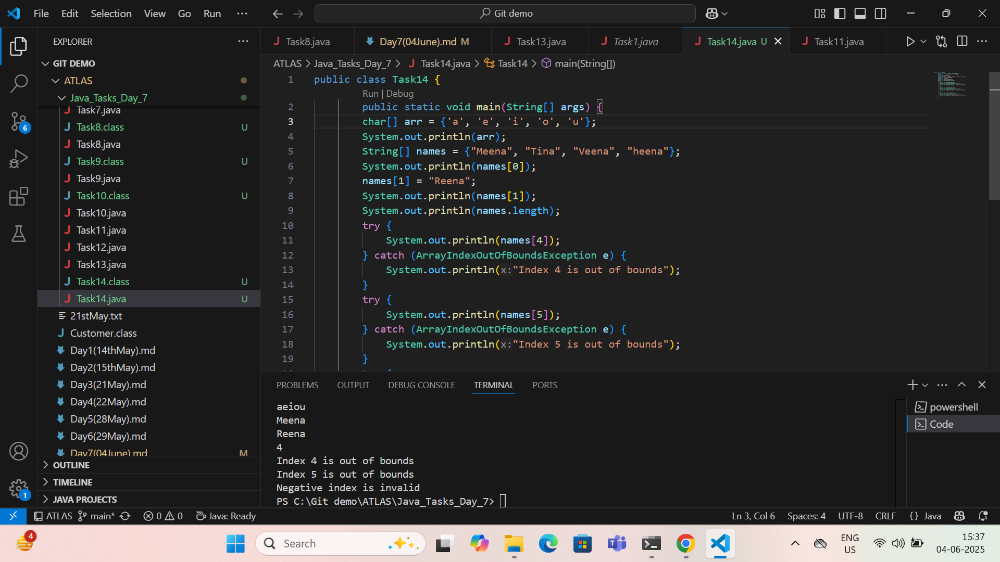

Day 7 : 04/06/2024 : Arham Mian : aarhammi@amazon.com

=============================================================================

----------------------Java fundamentals-------------------------

=============================================================================

Task 1 : 

Create a code to display 
“Hello guys!!!! “
“We are learning Java”

Using a single output statement…

Done , Screenshot : 

=============================================================================

Task 2:

Write a Program in Java to Add two Numbers.
Input: 2 3
Output: 5

Done, Screenshot :

=============================================================================

Task 3:

Write a Program to Swap Two Numbers
Input: a=2  b=5
Output: a=5  b=2

Done, Screenshot :

=============================================================================

Task 4:
 Create a code in which you have 4 methods add, subtract, multiply and divide (return type int) with a main method..to all all the other methods 

Out put:

Main started
Sum of 2 numbers is …..
Diff of 2 numbers is —-
Product of 2 numbers ….
Division of 2 numbers is ….
Main ended

Done, But unable to attach Screenshot because code was lengthy , please check the file [here](https://github.com/Arham-Mian/ATLAS_Practice/blob/main/Java_Tasks_Day_7/Task4.java)

=============================================================================

Task 5 : Write a program to check if a is greater or b.. Use ternary op

Done, But unable to attach Screenshot because code was lengthy , please check the file [here](https://github.com/Arham-Mian/ATLAS_Practice/blob/main/Java_Tasks_Day_7/Task5.java)

=============================================================================

Task 6 : Write a program to take input from the user and display it to the user

Input:

Id : Prasunamba
Pwd: 123456789

Output:

Hi ,

	Your login id is Prasuanmba
And your pwd is *********

HInt : 
For scanner … import java.util.scanner;

Scanner sc = new Scanner(System.in);
Id = sc.nexLine();

Done, But unable to attach Screenshot because code was lengthy , please check the file [here](https://github.com/Arham-Mian/ATLAS_Practice/blob/main/Java_Tasks_Day_7/Task6.java)

=============================================================================

Task 7 : 
Write a program to create a class named Customer 
Call the customer class in Task007 class using an object

Done, But unable to attach Screenshot because code was lengthy , please check the file [here](https://github.com/Arham-Mian/ATLAS_Practice/blob/main/Java_Tasks_Day_7/Task7.java)

=============================================================================

Task 8 : WAP to check the greater of 2 numbers

Hint:
Use if else

If ( num1 > num2){
	sout(“num1 is greater”);
}
Else {
	sout(“num2 is greater”);
}

Done, But unable to attach Screenshot because code was lengthy , please check the file [here](https://github.com/Arham-Mian/ATLAS_Practice/blob/main/Java_Tasks_Day_7/Task8.java)

=============================================================================

Task 9 : WAP to check greater of 3 numbers 

Done, But unable to attach Screenshot because code was lengthy , please check the file [here](https://github.com/Arham-Mian/ATLAS_Practice/blob/main/Java_Tasks_Day_7/Task9.java)

=============================================================================

Task 10 : 
Wap to check if check week days 

1  ===> sunday
2 ===> monday 
So on

8 and above ===> invalid input

Hint : use Switch case

Done, But unable to attach Screenshot because code was lengthy , please check the file [here](https://github.com/Arham-Mian/ATLAS_Practice/blob/main/Java_Tasks_Day_7/Task10.java)

=============================================================================

Task 11 : Wap to check loginid and password validation

Hint use while loop 

Scanner sc = new Scanner(System.in);

String loginid = “Prasunamba”
String pwd = “12345867”
Int Count = 0;

While (loginid == “Prasunamba” && pwd == “12345867”){
	sout(“ you have logged in for  ”+ count++ +” times”);
	sout(“enter ur login id and password”);
	loginid = sc.NextLine();
	pwd = sc.NextLine();	
}

Done, But unable to attach Screenshot because code was lengthy , please check the file [here](https://github.com/Arham-Mian/ATLAS_Practice/blob/main/Java_Tasks_Day_7/Task11.java)

=============================================================================

Task 12 :  Wap to check loginid and password validation

Hint use do while loop 

Scanner sc = new Scanner(System.in);

String loginid = “Prasunamba”
String pwd = “12345867”
Int Count = 0;

While (loginid == “Prasunamba” && pwd == “12345867”){
	sout(“ you have logged in for  ”+ count++ +” times”);
	sout(“enter ur login id and password”);
	loginid = sc.NextLine();
	pwd = sc.NextLine();	
}

Done, But unable to attach Screenshot because code was lengthy , please check the file [here](https://github.com/Arham-Mian/ATLAS_Practice/blob/main/Java_Tasks_Day_7/Task12.java)

=============================================================================

Task 13 : Wap to display numbers from 10 to 1 .. skip 7 and 5.

for(int i= 10; i >0; i–){
	If ( i == 5 || i == 7){
		Continue;
	sout(i);
}
}

Done, But unable to attach Screenshot because code was lengthy , please check the file [here](https://github.com/Arham-Mian/ATLAS_Practice/blob/main/Java_Tasks_Day_7/Task13.java)

=============================================================================

Task 14 : 
Arrays:

Try the below code and display the output… 
Now play with it try to access arr of 5th index and see the output…and try to access arr of -1 index and see the output..

package Arrays;

public class Demo01 {

	public static void main(String[] args) {
		// TODO Auto-generated method stub
		char[] arr = {'a','e','i','o','u'};
		System.out.println(arr);
		String[] names = {"Meena", "Tina", "Veena", "heena"};
		System.out.println(names[0]);
		names[1]= "Reena";
		System.out.println(names[1]);
		System.out.println(names.length);
		System.out.println(names[4]); 
		//Exception in thread "main" java.lang.ArrayIndexOutOfBoundsException
		
	}

}

Done , Screenshot : 

=============================================================================

